# 🔗 Blockchain Implementation with Django

A complete blockchain implementation built from scratch using Python and Django, featuring a web interface for managing wallets, creating transactions, mining blocks, and exploring the blockchain.


## 📋 Table of Contents

- [Features](#features)
- [Technologies Used](#technologies-used)
- [Project Structure](#project-structure)
- [Installation](#installation)
- [Usage](#usage)
- [Core Concepts](#core-concepts)
- [Screenshots](#screenshots)
- [Testing](#testing)
- [Project Report](#project-report)
- [Contributing](#contributing)
- [License](#license)
- [Author](#author)

---

## ✨ Features

### Core Blockchain Features
- ✅ **Block Structure**: Complete block implementation with hash, previous hash, timestamp, nonce, and transactions
- ✅ **Proof of Work (PoW)**: Configurable mining difficulty with computational puzzle solving
- ✅ **Transaction System**: Full transaction management with digital signatures
- ✅ **Digital Signatures**: ECDSA (Elliptic Curve Digital Signature Algorithm) using secp256k1 curve
- ✅ **Chain Validation**: Comprehensive blockchain integrity checking
- ✅ **Genesis Block**: Automatic creation of the first block in the chain

### Web Interface Features
- 🌐 **Blockchain Explorer**: Visual display of the entire blockchain
- 💼 **Wallet Management**: Create, import, and manage multiple wallets
- 💸 **Transaction Creation**: Send transactions between addresses
- ⛏️ **Block Mining**: Mine pending transactions with mining rewards
- 💰 **Balance Checking**: View balance and transaction history for any address
- 🔍 **Block Details**: Detailed view of individual blocks and transactions
- ✅ **Chain Validation**: Real-time blockchain integrity verification
- 📊 **Dashboard Statistics**: Overview of blockchain status and metrics

### Security Features
- 🔐 **Private Key Signing**: All transactions must be signed with private keys
- ✔️ **Signature Verification**: Automatic verification of transaction signatures
- 🛡️ **Balance Verification**: Prevention of overspending
- 🚫 **Double-Spend Prevention**: Protection against spending the same coins twice
- 🔒 **Immutability**: Tamper-evident blockchain structure

---

## 🛠️ Technologies Used

### Backend
- **Python 3.8+**: Core programming language
- **Django 4.2**: Web framework
- **hashlib**: SHA-256 cryptographic hashing
- **ecdsa**: Elliptic Curve Digital Signature Algorithm

### Frontend
- **HTML5 & CSS3**: Structure and styling
- **Bootstrap 5**: Responsive UI framework
- **JavaScript (ES6+)**: Client-side interactions
- **Font Awesome**: Icons

### Cryptography
- **SHA-256**: Block and transaction hashing
- **ECDSA**: Digital signatures with secp256k1 curve

---

## 📁 Project Structure
```
blockchain_django/
│
├── blockchain_project/          # Django project settings
│   ├── __init__.py
│   ├── settings.py             # Project configuration
│   ├── urls.py                 # Main URL routing
│   ├── wsgi.py                 # WSGI application
│   └── asgi.py                 # ASGI application
│
├── blockchain/                  # Main application
│   ├── __init__.py
│   ├── admin.py                # Django admin configuration
│   ├── apps.py                 # App configuration
│   ├── models.py               # Database models
│   ├── views.py                # View functions
│   ├── urls.py                 # App URL routing
│   ├── forms.py                # Django forms
│   │
│   ├── core/                   # Core blockchain logic
│   │   ├── __init__.py
│   │   ├── transaction.py      # Transaction class
│   │   ├── block.py           # Block class
│   │   ├── blockchain.py      # Blockchain class
│   │   └── wallet.py          # Wallet and key management
│   │
│   ├── templates/              # HTML templates
│   │   └── blockchain/
│   │       ├── base.html
│   │       ├── home.html
│   │       ├── wallet_list.html
│   │       ├── transaction_create.html
│   │       ├── transaction_pending.html
│   │       ├── mine_block.html
│   │       ├── check_balance.html
│   │       ├── address_detail.html
│   │       └── block_detail.html
│   │
│   └── static/                 # Static files
│       └── blockchain/
│           ├── css/
│           │   └── style.css
│           └── js/
│               └── script.js
│
├── manage.py                    # Django management script
├── requirements.txt             # Python dependencies
├── test_blockchain.py          # Blockchain testing script
├── .gitignore                  # Git ignore rules
└── README.md                   # This file
```

---

## 🚀 Installation

### Prerequisites
- Python 3.8 or higher
- pip (Python package manager)
- Git (optional)

### Step 1: Clone or Download the Project
```bash
# Clone with Git
git clone <repository-url>
cd blockchain_django

# Or download and extract the ZIP file
```

### Step 2: Create Virtual Environment
```bash
# Create virtual environment
python -m venv venv

# Activate virtual environment
# On Windows:
venv\Scripts\activate

# On macOS/Linux:
source venv/bin/activate
```

### Step 3: Install Dependencies
```bash
pip install -r requirements.txt
```

### Step 4: Run Migrations
```bash
python manage.py migrate
```

### Step 5: Create Superuser (Optional)
```bash
python manage.py createsuperuser
```

### Step 6: Run Development Server
```bash
python manage.py runserver
```

### Step 7: Access the Application
Open your browser and navigate to:
- **Application**: http://127.0.0.1:8000/
- **Admin Panel**: http://127.0.0.1:8000/admin/

---

## 📖 Usage

### 1. Create a Wallet
1. Navigate to **Wallets** page
2. Click **"Create New Wallet"**
3. Optionally provide a label
4. Save your **private key** securely!

### 2. Get Some Coins (Mining)
1. Go to **Mine** page
2. Enter your wallet address
3. Click **"Start Mining"**
4. You'll receive 100 coins as mining reward

### 3. Send a Transaction
1. Go to **Send** page
2. Select your wallet (or enter details manually)
3. Enter recipient address
4. Enter amount
5. Transaction is signed automatically
6. Click **"Create & Sign Transaction"**

### 4. Mine Transactions
1. Go to **Pending** page to see pending transactions
2. Click **"Mine Block"**
3. Enter your wallet address to receive mining reward
4. Wait for mining to complete

### 5. Check Balance
1. Go to **Balance** page
2. Enter wallet address
3. View balance and transaction history

### 6. Explore Blockchain
1. Home page shows all blocks
2. Click on any block to see details
3. Use **"Validate Chain"** to check integrity

---

## 🧠 Core Concepts

### Block Structure
Each block contains:
- **Index**: Position in the blockchain
- **Timestamp**: When the block was created
- **Transactions**: List of transactions in the block
- **Previous Hash**: Hash of the previous block
- **Nonce**: Number used in Proof of Work
- **Hash**: SHA-256 hash of the block

### Proof of Work (PoW)
Mining involves finding a nonce that makes the block hash start with a specific number of zeros (difficulty). This requires computational work and makes the blockchain secure.

**Example:**
- Difficulty = 4
- Valid hash must start with "0000..."
- Miner changes nonce until valid hash is found

### Transactions
Each transaction includes:
- **From Address**: Sender's public key
- **To Address**: Recipient's public key
- **Amount**: Number of coins to transfer
- **Timestamp**: When transaction was created
- **Signature**: Digital signature proving ownership

### Digital Signatures
Uses ECDSA with secp256k1 curve (same as Bitcoin):
1. Private key signs transaction hash
2. Public key verifies signature
3. Prevents unauthorized transactions

### Chain Validation
Validates entire blockchain by checking:
1. ✅ Each block's hash is correct
2. ✅ Each block links to previous block
3. ✅ Proof of Work is satisfied
4. ✅ All transactions have valid signatures
5. ✅ Genesis block is unchanged

---

---

## 📸 Screenshots

### Home & Blockchain Explorer

<table>
  <tr>
    <td width="50%">
      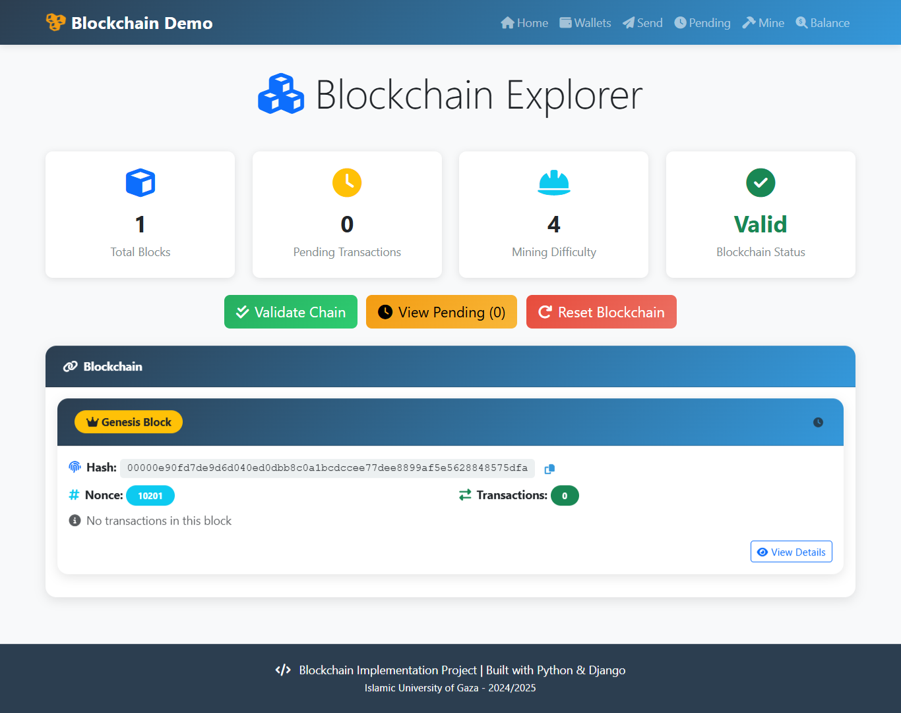
      <p align="center"> The Blockchain Explorer interface displays the status of the active blockchain, showing that the system has one block with no pending transactions and a valid chain.</p>
    </td>
    <td width="50%">
      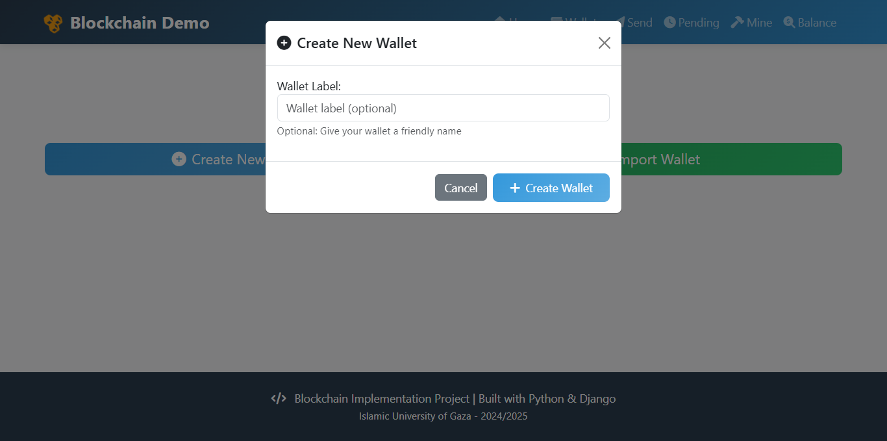
      <p align="center">Create New Wallet" allows users to generate a blockchain wallet with an optional label for easy identification.</p>
    </td>
  </tr>
</table>


<table>
  <tr>
    <td width="50%">
      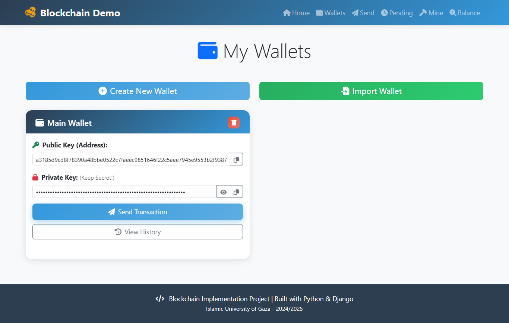
      <p align="center"> The interface displays a blockchain wallet with public key details and options to send transactions or view history.</p>
    </td>
    <td width="50%">
      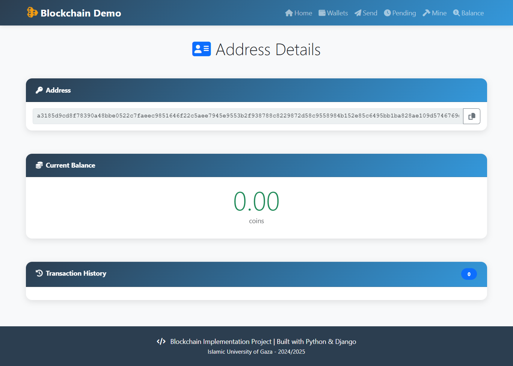
      <p align="center">Blockchain wallet with public key details and options to send transactions or view the log, highlighting secure key management.</p>
    </td>
  </tr>
</table>


<table>
  <tr>
    <td width="50%">
      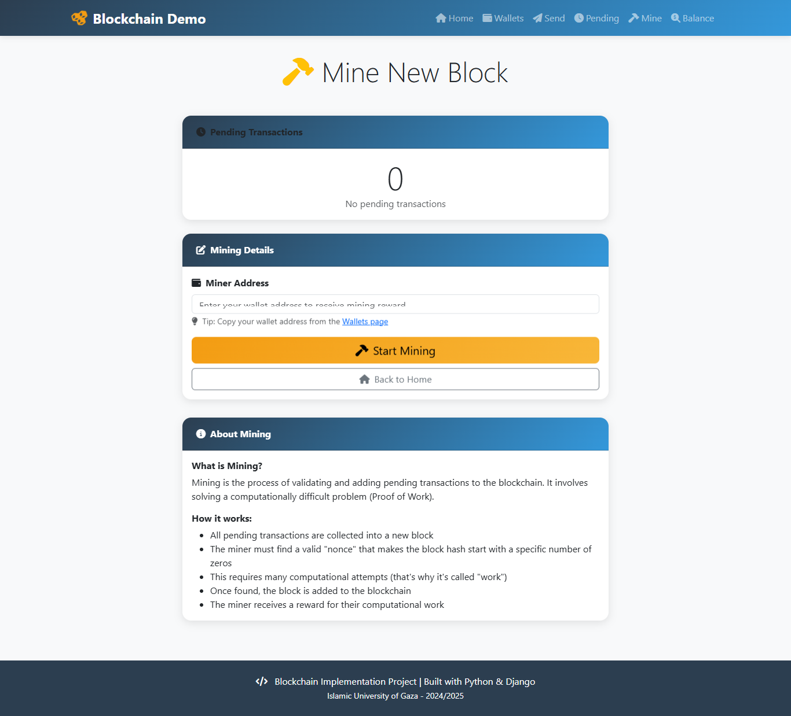
      <p align="center">Blockchain mining allows users to start creating a block by entering a wallet address.</p>
    </td>
    <td width="50%">
      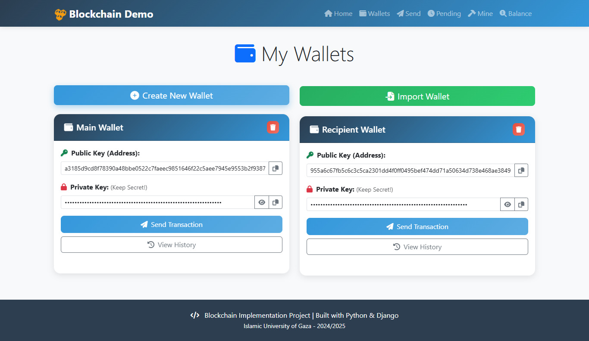
      <p align="center">Here is the wallet interface, the sender's and recipient's blockchain wallets with public keys and transaction options for making secure transfers.</p>
    </td>
  </tr>
</table>


<table>
  <tr>
    <td width="50%">
      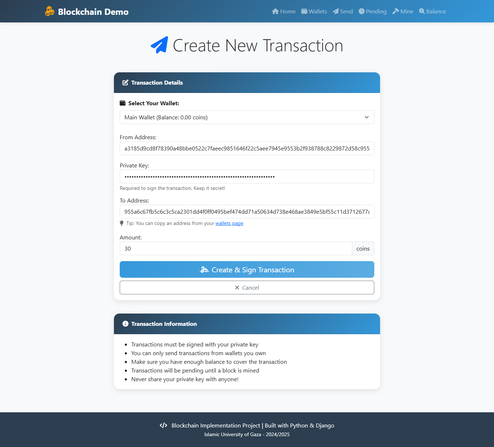
      <p align="center">Blockchain transactions are initiated and securely signed by identifying the sender, recipient, and amount.</p>
    </td>
    <td width="50%">
      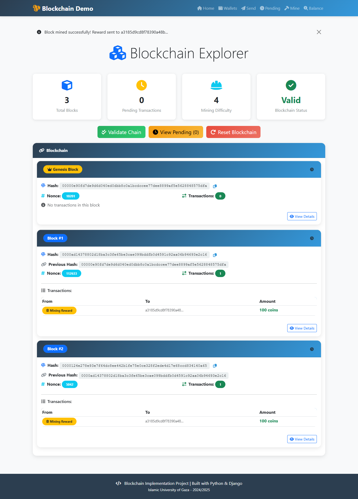
      <p align="center">Blockchain Explorer" is a three-block verified chain, including mining rewards and transaction history.</p>
    </td>
  </tr>
</table>


<table>
  <tr>
    <td width="50%">
      
      <p align="center">The transaction creation model allows users to send 30 coins from their wallet by securely signing with a private key.</p>
    </td>
    <td width="50%">
      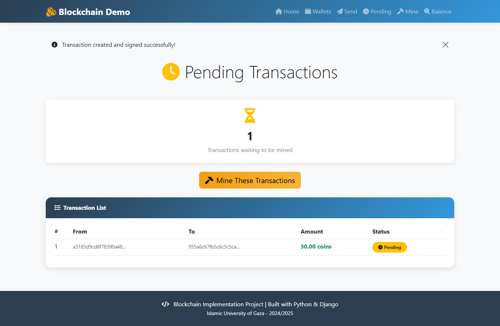
      <p align="center">There is a successfully signed transaction now pending mining, with full details of the sender and receiver.</p>
    </td>
  </tr>
</table>


<table>
  <tr>
    <td width="50%">
      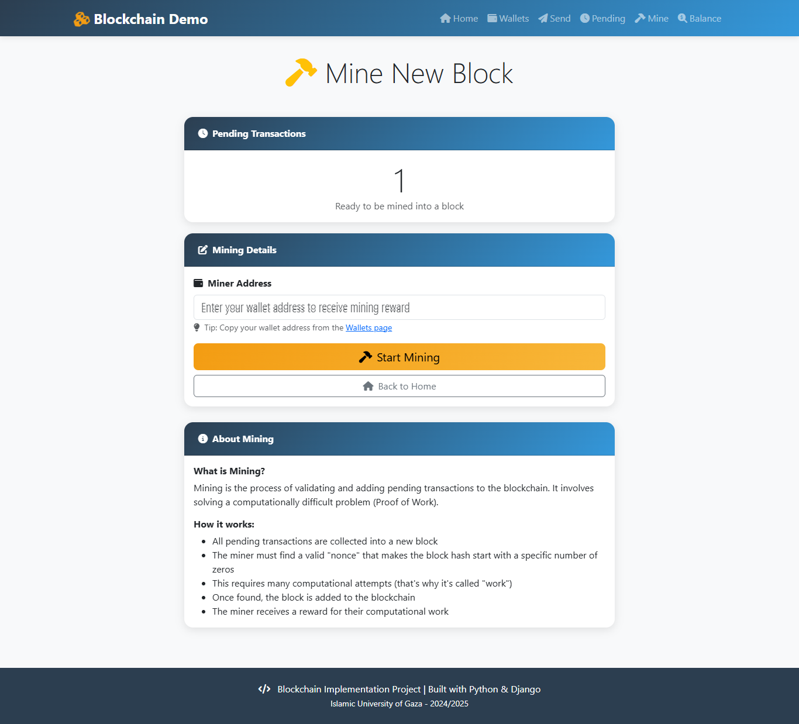
      <p align="center">The "New Block Mining" page has one pending transaction ready for mining, with instructions and reward setup.</p>
    </td>
    <td width="50%">
      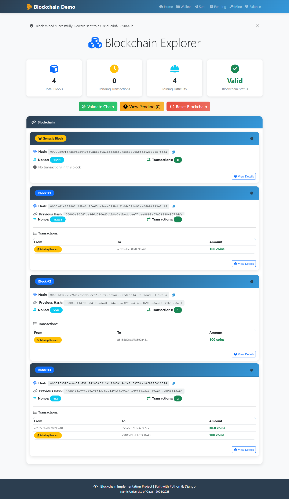
      <p align="center">Blockchain Explorer is a valid chain of four blocks, including mining rewards and user transactions.</p>
    </td>

  </tr>
</table>
<table>
  <tr>
    
 <td width="50%">
      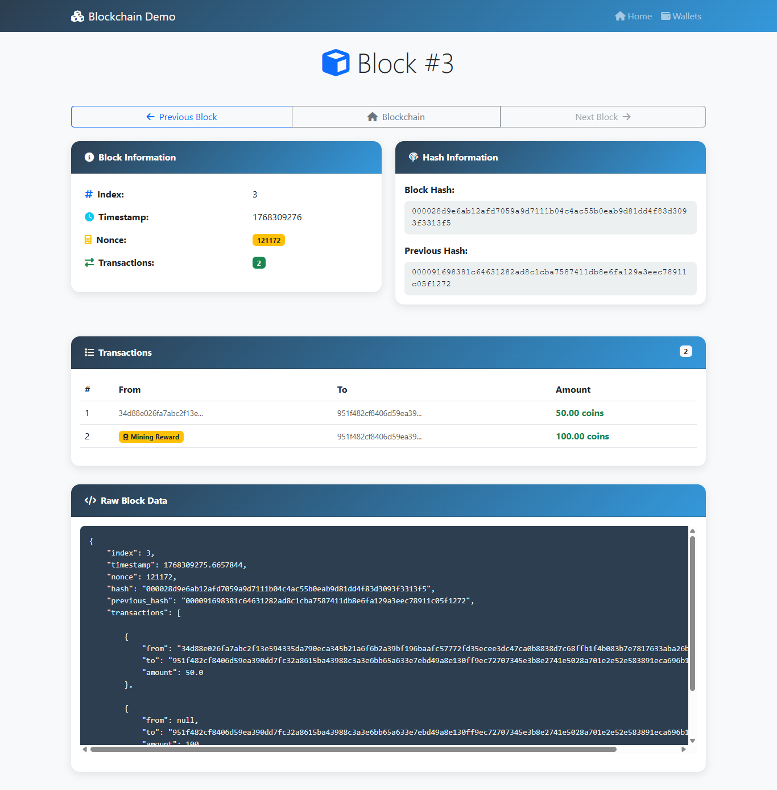
      <p align="center">Block details number 3 show two transactions, including a transfer of 50 coins and a mining reward of 100 coins.</p>
    </td>
  </tr>
</table>


---


## 🧪 Testing

### Run Core Tests
```bash
python test_blockchain.py
```

This will test:
- ✅ Wallet generation
- ✅ Transaction creation and signing
- ✅ Block mining
- ✅ Blockchain validation
- ✅ Balance calculation
- ✅ Tampering detection

### Expected Output
```
============================================================
Testing Blockchain Core Classes
============================================================

1. Creating Wallets...
Wallet 1: 04a1b2c3d4e5f6...
Wallet 2: 04b2c3d4e5f6a7...
Wallet 3: 04c3d4e5f6a7b8...

2. Creating Blockchain...
Genesis block created: Block(hash=0000abc123...)

3. Mining first block for Wallet 1...
Block mined: 00001234abcd...
Wallet 1 balance: 100

... [more tests]

Test completed successfully!
============================================================
```

### Manual Testing Checklist
- [ ] Create multiple wallets
- [ ] Mine initial blocks to get coins
- [ ] Send transactions between wallets
- [ ] Mine transactions into blocks
- [ ] Check balances are correct
- [ ] Validate blockchain integrity
- [ ] Try to send more than balance (should fail)
- [ ] Try to sign with wrong private key (should fail)
- [ ] Manually tamper with a block (validation should fail)

---

## 📄 Project Report

### Block Structure
The block contains all necessary information to maintain blockchain integrity:
```python
{
    "index": 1,
    "timestamp": 1704067200.0,
    "transactions": [...],
    "previous_hash": "0000abc123...",
    "nonce": 45672,
    "hash": "00001234def..."
}
```

### Proof of Work Implementation
```python
def mine_block(self, difficulty: int) -> None:
    target = '0' * difficulty
    while self.hash[:difficulty] != target:
        self.nonce += 1
        self.hash = self.calculate_hash()
```

**Mining Time Analysis:**
| Difficulty | Average Time |
|------------|--------------|
| 2          | < 1 second   |
| 3          | ~2 seconds   |
| 4          | ~10 seconds  |
| 5          | ~60 seconds  |

### Blockchain Validation Process
1. **Genesis Block Check**: Verify first block matches expected structure
2. **Hash Verification**: Recalculate each block's hash and compare
3. **Chain Linking**: Verify previous_hash matches actual previous block hash
4. **Proof of Work**: Ensure each hash meets difficulty requirement
5. **Transaction Validation**: Verify all transaction signatures

### Challenges Faced
1. **Session Management**: Implemented session-based storage for blockchain persistence
2. **Form Validation**: Ensured proper balance checking and signature verification
3. **UI/UX Design**: Created intuitive interface for complex blockchain operations
4. **Performance**: Optimized mining with appropriate difficulty level
5. **Security**: Prevented common attacks (double-spending, signature forgery)

### Lessons Learned
- Understanding Proof of Work computational requirements
- Importance of digital signatures for transaction security
- Session management for stateful blockchain storage
- Balance validation to prevent overspending
- Chain validation for detecting tampering

---

## 🤝 Contributing

Contributions are welcome! Please follow these steps:

1. Fork the repository
2. Create a feature branch (`git checkout -b feature/AmazingFeature`)
3. Commit your changes (`git commit -m 'Add some AmazingFeature'`)
4. Push to the branch (`git push origin feature/AmazingFeature`)
5. Open a Pull Request

---

## 📜 License

This project is licensed under the MIT License - see the LICENSE file for details.

---

## 👨‍💻 Author

**Alaa Emad Al hout**  
Master's Student in Information Technology  
Islamic University of Gaza

**Course**: Cyber Security  
**Academic Year**: 2025/2026

---

## 🙏 Acknowledgments

- Based on [SavjeeCoin](https://github.com/Savjee/SavjeeCoin) JavaScript implementation
- Inspired by Bitcoin's blockchain technology
- Tutorial videos by Simply Explained
- Django documentation and community

---

## 📞 Support

If you have any questions or issues:

- Contact: [alaaalhoot74@gmail.com]

---

## 🔗 Useful Links

- [Bitcoin Whitepaper](https://bitcoin.org/bitcoin.pdf)
- [Blockchain Explained](https://www.youtube.com/watch?v=SSo_EIwHSd4)
- [Django Documentation](https://docs.djangoproject.com/)
- [ECDSA Explained](https://en.wikipedia.org/wiki/Elliptic_Curve_Digital_Signature_Algorithm)

---

**⭐ If you found this project helpful, please give it a star!**

---

*Built with ❤️ using Python and Django*